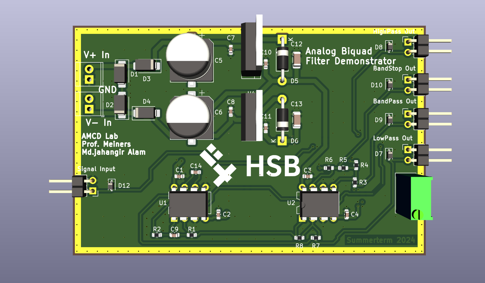

# 06 – PCB Fabrication

Our design was implemented on a 4-layer PCB for noise immunity and performance.

### Features

- Ground planes on inner layers
- Stitching vias and fencing vias
- ESD protection with TVS diodes
- KiCad used for layout

# 06 – PCB Fabrication

This section includes the PCB design for the Analog BIQUAD Filter Demonstrator, created using KiCad and optimized for low-noise analog performance.

---

### Full Schematic Diagram

The complete design includes:
- Power splitter and regulator
- Op-amp-based BIQUAD filter
- Output connectors and labeling for each filter type

---

###  3D Render of Final PCB

This 3D view shows the final version of the board with:
- Clearly labeled filter outputs: HPF, BPF, BSF, LPF
- Proper power input via headers
- Op-Amps and passive components placed efficiently
- Board identification and lab info

---

The PCB was fabricated using a 4-layer stack-up with internal ground planes, stitched vias, and TVS protection to ensure signal integrity and robustness in lab demonstrations.
