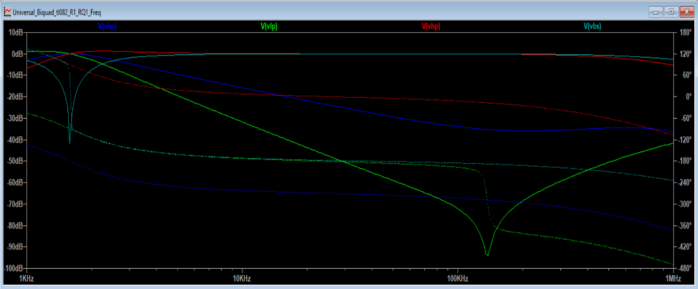

# 04 – LTspice Simulation

This section presents simulations done in LTspice for various BIQUAD filter topologies.

### Simulated Responses

- Frequency response for LPF, HPF, BPF, BSF
- Step response with Q=1 and Q=10

### Band-Pass Filter Frequency Response

This is the LTspice simulation output showing frequency responses of multiple filter types (Band-pass, Low-pass, High-pass, and Band-stop):

### Band-Pass Filter Simulation Output

This LTspice simulation shows the frequency responses of different filter configurations including:

- Band-Pass (V(bp))  
- Low-Pass (V(lp))  
- High-Pass (V(hp))  
- Band-Stop (V(bs))

The simulation was done using universal BIQUAD topology.

