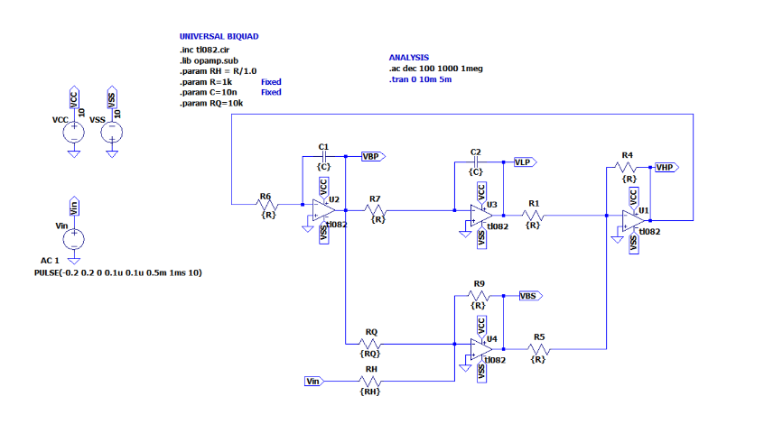

# 05 – Circuit Design

Moving from simulation to real-world hardware requires careful component selection and layout.

### Practical Design Tips

- Use low tolerance resistors and capacitors
- Watch for PCB parasitics: trace inductance, stray capacitance
- Place decoupling capacitors close to op-amps
- Test first on a breadboard or ASLK Pro board

### Example Schematic

