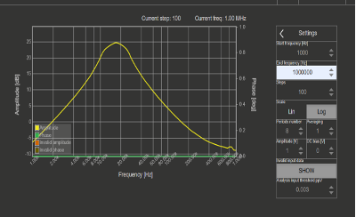
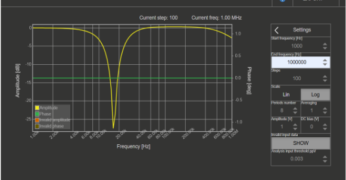
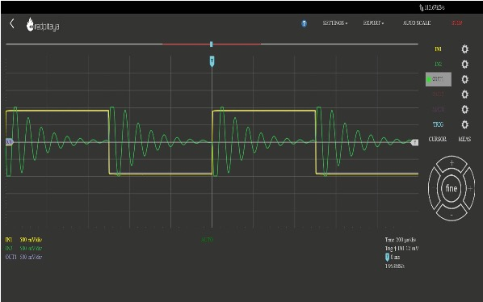
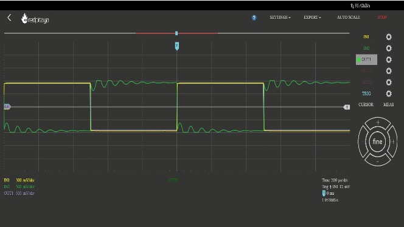

# 07 – Hardware Setup

Final hardware was tested using Red Pitaya and ASLK Pro.

### Equipment Used

- Red Pitaya STEMlab
- ASLK Pro development board
- Oscilloscope and signal generator

# 07 – Hardware Setup

This section shows the practical testing of the Analog BIQUAD Filter circuit using **Red Pitaya STEMlab**, a regulated power supply, and a digital oscilloscope.

---

### 🧪 Full Hardware Testbench Setup

The image below shows the experimental setup:
- Red Pitaya STEMlab generating signals and reading response
- ASLK Pro board holding the BIQUAD circuit
- Dual-channel DC power supply
- Oscilloscope for real-time observation

---

### 📈 Frequency Response – Band-Pass Filter

Measured using Red Pitaya software interface.

---

### 📉 Frequency Response – Band-Stop Filter

---

### 🔁 Step Response – Band-Pass Output

---

### 🔁 Step Response – Band-Stop Output

